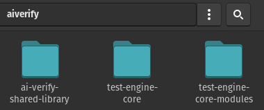
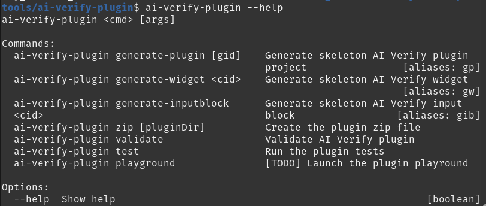

# Installing AI Verify Developer Tools

## Before You Begin 

The Developer Tools require specific modules from the main AI Verify repository. If you have not installed AI Verify, use sparse-checkout on AI Verify monorepo to selectively checkout files that are relevant to the Developer Tools. 

1. Clone the required modules
```bash
git clone git@github.com:IMDA-BTG/aiverify.git # requires Github public SSH key
cd aiverify
git sparse-checkout init --cone
git sparse-checkout set ai-verify-shared-library test-engine-core-modules test-engine-core
cd ..
```

After the sparse checkout, you should end up with these three folders in your aiverify project directory. Please take note of the **test-engine-core-modules** path, as you will need it later while testing the algorithm component. 



## Installing Dependencies

Install the following dependencies if they are not already available.

1. Install jq and zip
```bash
sudo apt-get install -y jq zip
```

2. Install Python and its virtual environment packages
```bash
sudo apt-get install -y python3.10 python3-pip python3.10-venv
```

3. Install NodeJS
```bash
curl -sL https://deb.nodesource.com/setup_18.x | sudo -E bash -
sudo apt-get install -y nodejs
```

## Preparing a Virtual Environment

We recommend setting up a virtual environment for your plugin project to ensure that these libraries will not mess up your main development environment.

1. Create a virtual environment
```bash
python3 -m venv my_virtual_environment
```

2. Activate your newly created virtual environment
```bash
source my_virtual_environment/bin/activate
```

3. Check that you're working from the virtual environment
```bash
which python # you should see something like <working dir>/my_virtual_environment/bin/python
```

4. Install plugin dependencies in your virtual environment
```bash
pip install --upgrade pip
pip install cookiecutter pandas==1.5.2 scikit-learn
```

5. Install AI Verify Test Engine Core.
```bash
cd aiverify/test-engine-core
pip install dist/test_engine_core-0.9.0.tar.gz
cd ../..
```

6. Install necessary requirements from `test-engine-core-modules`.
```bash
cd aiverify/test-engine-core-modules
pip install -r requirements.txt
cd ../..
```

7. Install dependencies and build AI Verify Frontend Shared Library
```bash
cd aiverify/ai-verify-shared-library
npm install
npm run build
```

## Installing AI Verify Developer Tools

Install AI Verify Developer Tools in your environment.

1. Clone our developer's repository.
```bash
git clone git@gitlab.com:imda_dsl/t2po/ai-verify/aiverify-developer-tools.git # requires Github public SSH key
```

2. Install AI Verify Frontend Plugin Tool
```bash
cd aiverify-developer-tools/ai-verify-plugin
npm install
npm install ../../aiverify/ai-verify-shared-library
sudo npm install -g # You may need sudo for this command
ai-verify-plugin --help
```

If the installation is successful, you should see a similar output as shown below.


Congratulations! You are ready to create your first plugin.