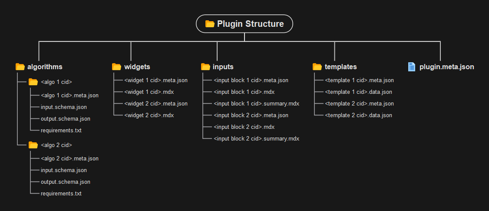
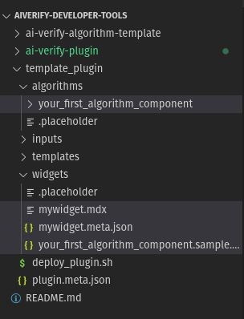
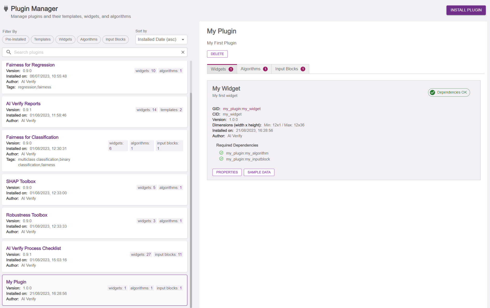
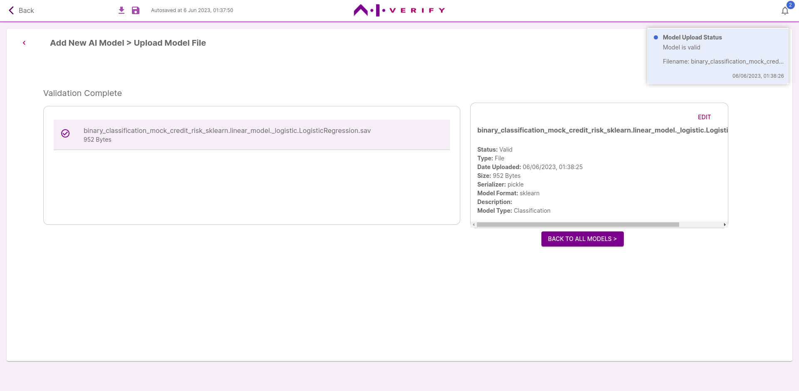
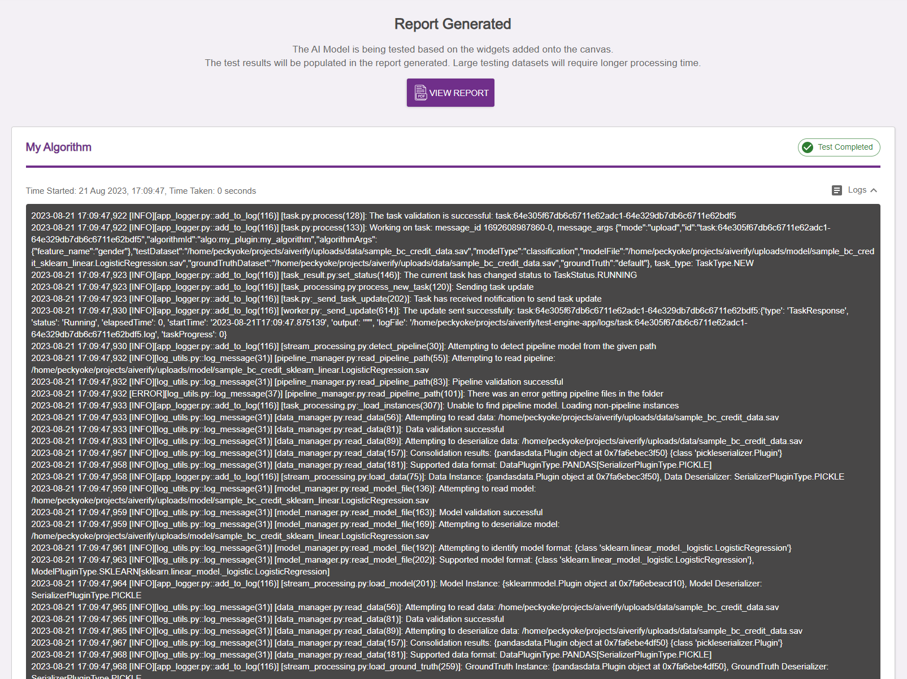

# Deploy Your Plugin

Now that you have created your plugin component(s), it is time to package it into a single plugin for deployment.

If you are following the guided example, you should have the following components completed and packaged in its own respective folders:

1. your-first-algorithm-component component
2. your-first-widget component

At this point, you may decide if you wish to deploy the components as two separate plugins (i.e. algorithm plugin and widget plugin), or combine and package it as a single plugin. Each method comes with its own rationale and benefit.

| Deployment Style | Description                                                 | Rationale |
| ---------------- | ----------------------------------------------------------- | --------- |
| **Combine**      | Combine components into a single plugin zip                 | Combine components when they are tightly coupled, eg. input block component needed for the algorithm component to run properly, widget component needed to display algorithm results etc |
| **Separate**     | Separate the components into its own respective plugin zips | This is a more modular design approach. Some components do not have additional dependencies, or are add-ons to existing plugins. eg. Additional widget plugins for different ways to display algorithm results. |

## Combine the plugin components

The **template_plugin** directory should mimic the same plugin structure. The algorithms directory should contain algorithms, with each one in its own respective folder. The widget components will be stored in the widgets directory.



In this guided example, the algorithms directory will have the folder *your_first_algorithm_component*. The widgets directory will contain *mywidget.meta.json*, *mywidget.mdx*, and *your_first_algorithm_component.sample.json*.

It should look something like this:



## Edit Plugin Details (Optional)

You may wish to edit *plugin.meta.json* to change the plugin details.

```py title="plugin.meta.json" linenums="1" hl_lines="2 3 4 5 6"
{
    "gid": "your_first_plugin",
    "version": "0.1.0",
    "name": "Your First Plugin",
    "author": "Example Author",
    "description": "This is your first plugin"
}

```

## Deploy your Plugin

We have provided a script that helps package and deploy your plugin. If you have not created a widget component at this point, this will package the algorithm as a standalone plugin. To run the script, navigate to the directory with the script `deploy_plugin.sh`. This is located at the **root of template_plugin** folder. At the directory, enter:

```bash
# Execute this script in the template_plugin directory
./deploy_plugin.sh
```

!!! note
    A new folder `dist` will be created. This folder is where the packaged `.zip` file will be created and placed.

If you did not edit the gid, verify that the zip file ```your_first_plugin-0.1.0.zip``` exists in your `dist` directory:

```bash
ls dist | grep your_first_plugin
```

The resulting plugin is packaged as a `zip` file, which can be used to share with other developers who are interested in using your plugin. Users and developers can then upload the zip file onto AI Verify through the plugin manager and use it in the report.


## Uploading the plugin

To upload the plugin, start the frontend portal of AI Verify. You will need to install AI Verify if you have not done so. The instructions to install and run AI Verify from source code can be found in the [User Guide](https://imda-btg.github.io/aiverify-user-guide-docs/getting-started/source-code-setup/).

1. Once the portal is started up, visit the portal at [http://localhost:3000/home](http://localhost:3000/home). In the homepage, click on "Plugins" to visit the Plugin Manager page:
   

2. In the **Plugin Manager page**, click on "INSTALL PLUGIN" at the top right and select ```your_first_plugin-0.1.0.zip```, then click on "INSTALL" :
   

   
3. The following prompt should appear to inform you that the plugin has been installed successfully: 

      

4. You should see your plugin in the list of installed plugins:
   

## Generating the Report

1. It is time to run the plugin. In the homepage, click on "Create New Project":
   
2. Fill in the project details and click "Next" on the top right:
    
3. On the **Design Report** page, drag your widget from the left panel to the canvas:
   
   You can resize the the widget and click on the alignment buttons to refresh its size. When you're ready, click "Next" on the top right.
4. On the **Select the Datasets and AI Model to be tested** page, select and upload the dataset, ground truth dataset and model. You can use the dataset provided in the template. Refer to the following table for reference.

      | Data, Model, and Test Arguments | Selected Dataset / Model / Test Arguments |
      | ---- | ---------- |
      | Testing Dataset | ```pickle_pandas_mock_binary_classification_credit_risk_testing.sav``` |
      | Ground Truth Dataset | ```pickle_pandas_mock_binary_classification_credit_risk_testing.sav```, Ground Truth: ```default``` |
      | AI Model | ```binary_classification_mock_credit_risk_sklearn.linear_model._logistic.LogisticRegression.sav``` | 
      | Test Arguments | ```gender``` |

5. For the model, choose ```Upload AI Model``` and click "Next".
   
6. We will be uploading the ```binary_classification_mock_credit_risk_sklearn.linear_model._logistic.LogisticRegression.sav``` model.
    
7. Type `gender` into the plugin arguments. The end result should look like this.
    
8. When you are ready, click on "Next" on the top right. Click on "PROCEED" when prompted:
    
9. You should see the logs of what is happening in the backend and when your report has been generated, you should see the "Test Completed" prompt in the top right. Click on "VIEW REPORT" to see your report:
    
10. Your report will be displayed as a PDF file.
    
   Congratulations! You have generated your first report. 